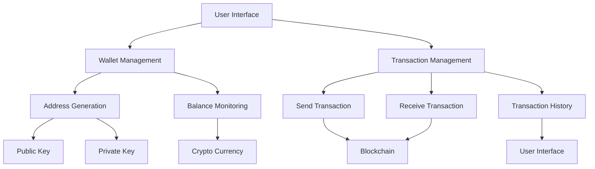

```mermaid
  graph TD;
    A[User Interface] --> B[Wallet Management];
    A --> C[Transaction Management];
    B --> D[Address Generation];
    B --> E[Balance Monitoring];
    C --> F[Send Transaction];
    C --> G[Receive Transaction];
    C --> H[Transaction History];
    D --> I[Public Key];
    D --> J[Private Key];
    E --> K[Crypto Currency];
    F --> L[Blockchain];
    G --> L[Blockchain];
    H --> M[User Interface];
```